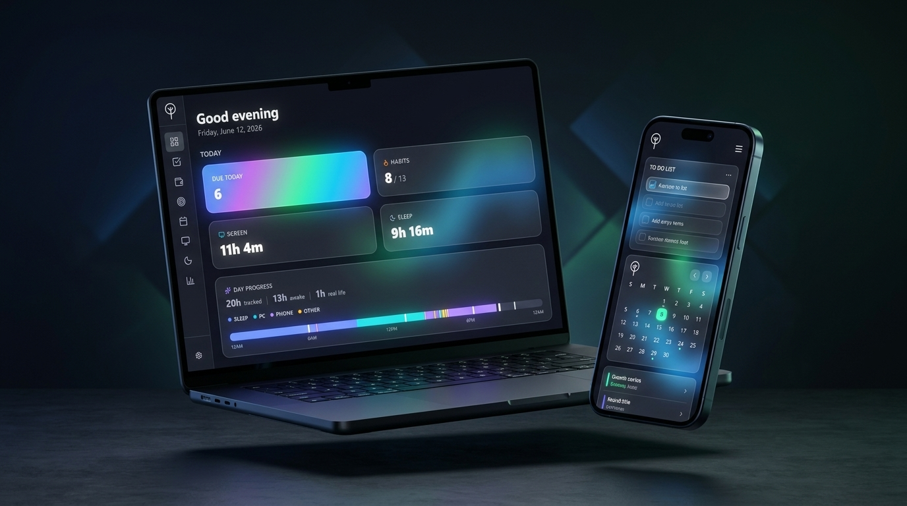
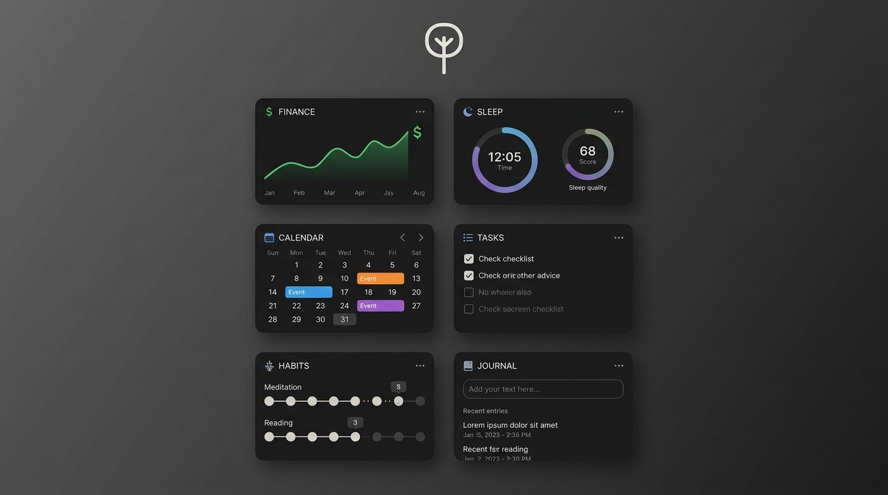
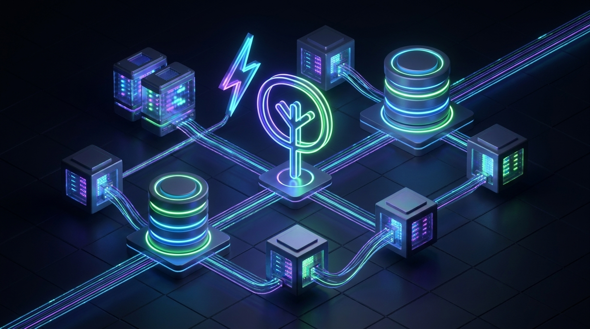

  <h1>🌟 lifeOS</h1>
  
<strong>Your personal operating system for a focused, balanced, and intentional life.</strong>

  
Turn “I should…” into <b>a concrete, calm plan</b> — and keep it close enough to reality that you’ll actually follow it.

  
  

    <a href="https://life-os-tan.vercel.app"><b>✨ View Live Demo ✨</b></a>
  

  

    <b>📥 Download Desktop App:</b> 
    
    
    
  

  
  
  

    
    
    
    
    
    
  

---

## 🚀 The Vision

An OS for your life where your **intent** (plans) and your **evidence** (what actually happened) live together. Iterate on your routines with the same clarity, precision, and ease you use to ship high-quality software. 

**lifeOS is built for the problem that most tools avoid:** your life is multi-domain, but your execution needs to feel like one unified system.

## 💎 Why lifeOS?

- 🧠 **One Home for Execution:** Stop context-switching. Tasks, habits, schedules, and key metrics all live under one roof.
- 🔄 **A Tighter Feedback Loop:** Plan the week ➡️ Run today ➡️ Review trends (sleep, screentime, finance, habits) ➡️ Adjust and improve.
- ⚡ **Zero UI Tax:** Utilizing a consistent "details sheet" pattern across all modules ensures managing your system stays lightning fast.
- 🔒 **Your Data, Your Metrics:** User-scoped analytics and strict auth boundaries mean your data is yours alone.
- 📱 **Fits Your Workflow:** Built web-first, with robust PWA support so you can install it on your phone or desktop.

---

## ✨ Everything You Need, In One Place

### 📊 **The Command Center (Dashboard)**
Get a bird's-eye view of your life. 
* **Customizable Widgets:** Tailor your dashboard to show exactly what matters to you.
* **Daily & Strategic Overviews:** Quick-view "Today" metrics and strategic panels for long-term goals.

### ✅ **Smart Task & Goal Management**
More than just a to-do list.
* **Intelligent Views & Tags:** Slice your tasks by Today, Week, Upcoming, Completed, or "Won't-do". Organize with custom tags.
* **Strategic Goals:** Break down yearly goals into manageable quarterly objectives and link them to your daily tasks.
* **Weekly Planner:** Plan your week by day. Add items that magically create real tasks due on that specific day.
* **Focus Mode:** Track focus time and track urgent/flagged items.

### 🔄 **Advanced Habit Engine**
Build routines that stick.
* **Track Anything:** Support for standard and detox (incremental/exponential) habits, adherence tracking, and streak visualization.
* **Specialized Routines:** Built-in tracking for Prayer habits seamlessly connected to Supabase Edge Functions for smart notifications.

### 📅 **Unified Calendar & Events**
Own your time.
* **Calendar Sync:** Full calendar event support with iCal subscription capabilities.
* **Task-to-Calendar Links:** Seamlessly sync tasks to calendar blocks and vice versa.

### 💰 **Complete Financial Hub**
Absolute clarity on your money.
* **Smart Budgeting:** Track transactions, set category budgets, and view intelligent cash-flow summaries.
* **Automated Ingestion:** Forward bank SMS alerts or use intelligent transaction rules to automatically categorize expenses.
* **Investment Portfolio:** Track investment accounts and specialized investment transactions alongside daily spending.

### 🧠 **Health & Wellness Tracking**
Optimize your energy and body.
* **Sleep Analytics:** Track sleep sessions, sleep stages (Core, Deep, REM), and sleep scores.
* **Body Metrics:** Log InBody scans tracking weight, BMI, skeletal muscle mass, body fat percentage, and BMR.
* **Wellness Logs:** Keep daily tabs on overarching wellness metrics.

### 📱 **Digital Wellbeing (Screentime)**
Take back your attention.
* **Granular Tracking:** Daily summaries of app usage, website visits, session counts, and total switches.
* **Automated Sync:** Edge Function pathways for effortless cross-platform data ingestion.

### 📚 **Knowledge & Project Management**
Your personal database.
* **Rich Notes:** Capture ideas effortlessly with folder-organized rich-text notes.
* **Project Tracking:** Manage structured projects like Theses, Certifications, or Coding ventures.
* **Academic Paper Library:** Track research papers, methodologies, key findings, and reading statuses linked directly to your projects.

### 📈 **Cross-Domain Analytics**
Connect the dots.
* Compare trends across habits, tasks, sleep, screentime, and finance to discover incredible insights about your personal performance.

---

## 🛠 Tech Stack

Built with a modern, high-performance, and scalable stack:

- **Frontend Core:** React 19, React Router, TypeScript
- **Styling:** Tailwind CSS + custom UI primitives (`src/components/ui/*`)
- **State Management:** Zustand (`src/stores/*`)
- **Backend & Database:** Supabase (`src/lib/supabase.ts`) + React Query for lightning-fast caching
- **Serverless Power:** Supabase Edge Functions (`supabase/functions/`) & Vercel API routes (`api/`)
- **Deployment:** Vercel (`vercel.json`)
- **Offline / PWA:** `src/sw.ts` + `vite-plugin-pwa`

---

  
Built with ❤️ to help you reclaim your time.

